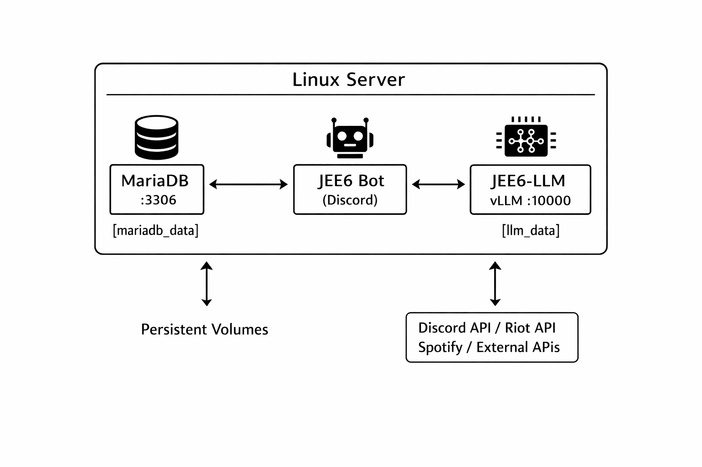

# JEE6-INFRA

JEE6 서비스 전체를 Docker Compose로 관리하는 orchestration repository입니다.

## Architecture



```
JEE6-INFRA/
├── apps/
│   ├── JEE6.v1/          # Discord 봇 submodule
│   └── JEE6-LLM/         # vLLM 서버 submodule
├── infra/
│   ├── docker-compose.yml       # 프로덕션 compose
│   ├── docker-compose.dev.yml   # 개발용 오버라이드
│   ├── deploy.sh                # 배포 스크립트
│   ├── env/
│   │   ├── bot.env.example
│   │   ├── db.env.example
│   │   └── llm.env.example
│   └── init-db/
│       └── 01-init.sql
├── .github/workflows/
│   └── deploy.yml               # CI/CD (SSH 자동 배포)
└── Makefile
```

## Prerequisites

- Docker, Docker Compose
- Git
- Make
- GPU 서버의 경우 NVIDIA Container Toolkit

## Commands

```bash
git clone --recursive https://github.com/8G4B/JEE6-INFRA.git
cd JEE6-INFRA

make setup

vi infra/env/bot.env
vi infra/env/db.env
vi infra/env/llm.env

make up
```


| 명령어 | 설명 |
|--------|------|
| `make setup` | env 예제 파일을 복사하여 초기 설정 |
| `make up` | 전체 서비스 빌드 및 시작 |
| `make down` | 전체 서비스 중지 |
| `make restart` | 전체 서비스 재시작 |
| `make pull` | 최신 코드 pull 후 재배포 |
| `make logs bot` | 봇 로그 확인 |
| `make logs mariadb` | DB 로그 확인 |
| `make status` | 서비스 상태 확인 |
| `make dev` | 개발 모드 (소스 마운트, DB 포트 노출) |

## CI/CD

`master` 브랜치에 push하면 GitHub Actions가 서버에 SSH로 접속하여 자동 배포합니다.

GitHub Secrets:

| Secret | 설명 |
|--------|------|
| `SERVER_HOST` | 서버 IP 또는 도메인 |
| `SERVER_USER` | SSH 사용자명 |
| `SERVER_SSH_KEY` | SSH 개인키 |
| `DEPLOY_PATH` | 서버 내 프로젝트 경로 |
